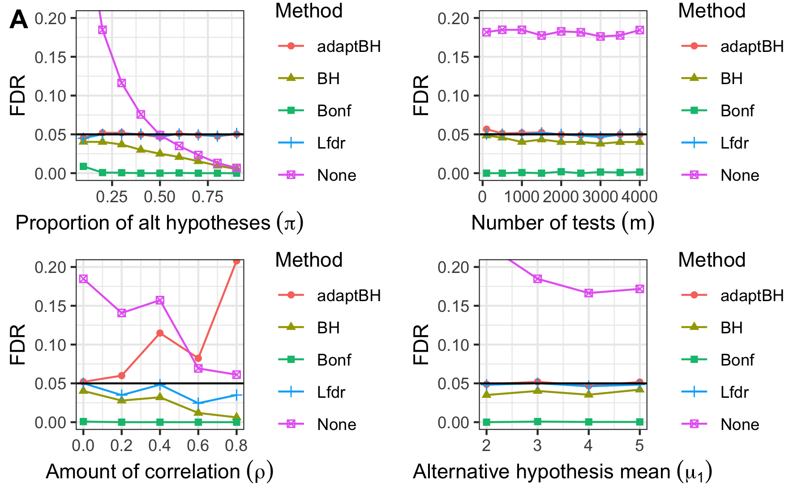
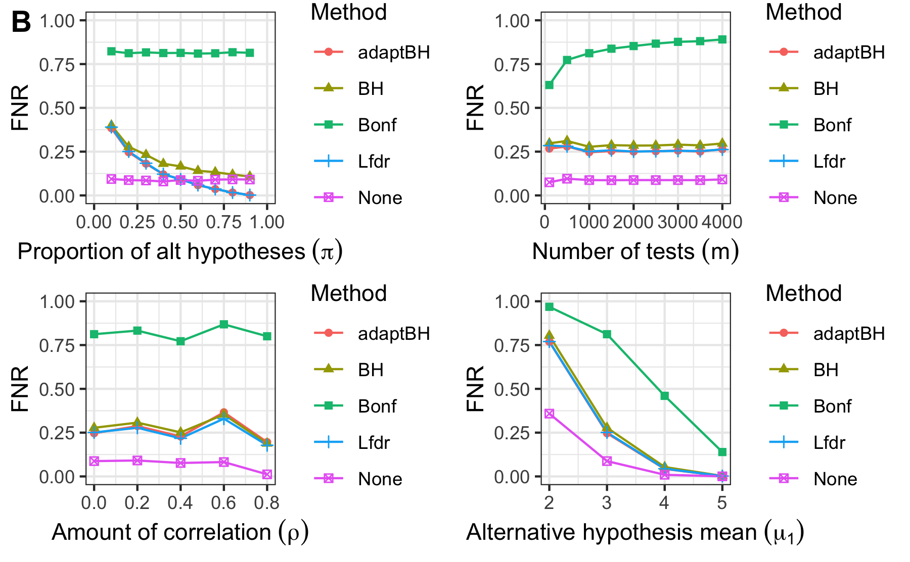
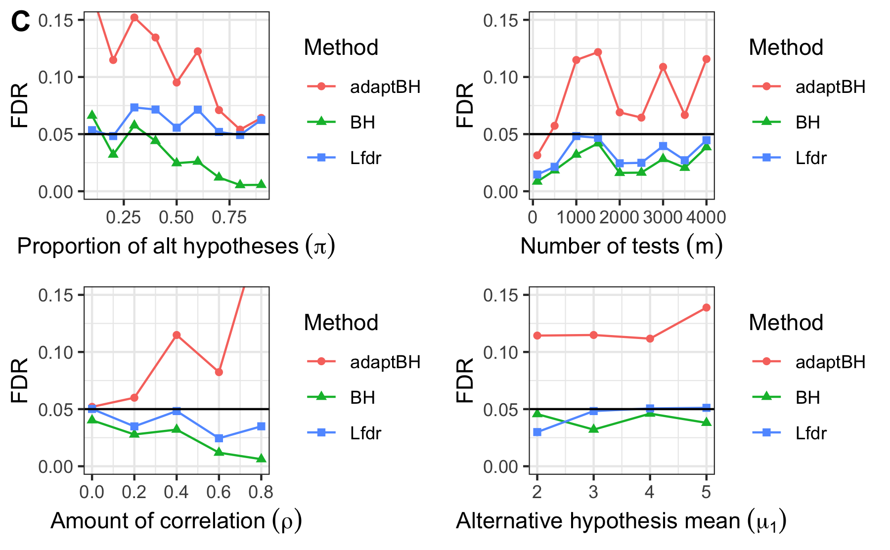
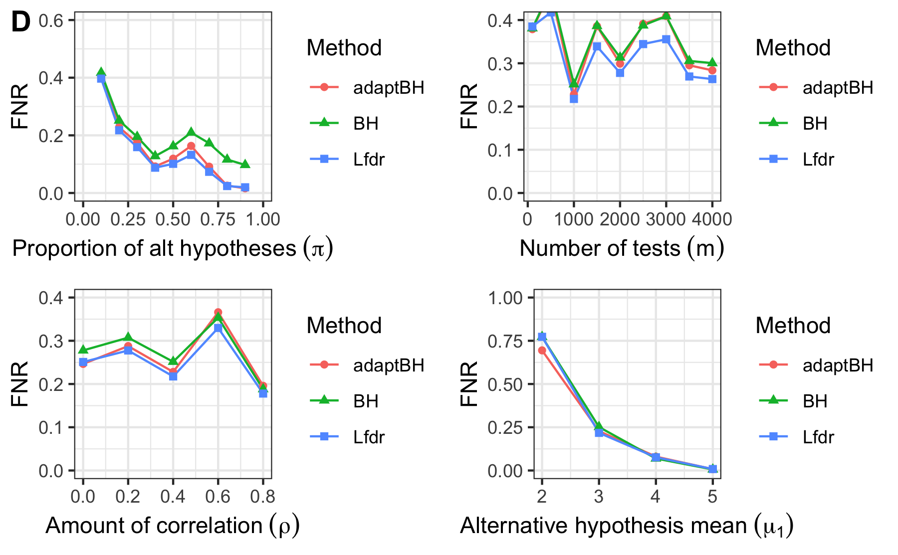

```{r setup, include=FALSE}
knitr::opts_chunk$set(echo = TRUE)
```
## Abstract

This paper uses an untargeted metabolomics case study to investigate different methods of false discovery rate control. The case study aims to find differences in the thousands of detectable metabolites in the synovial fluid between two groups of horses, some treated with flavopiridol and others given saline control. To find differences, a hypothesis test $H_0: \text{Treatment = Control vs } H_1: \text{Treatment} \neq \text{Control}$ is conducted for each of the 2,926 metabolites detected. The Benjamini-Hochberg adjustment (BH), data adaptive Benjamini-Hochberg method (adaptBH), and a local false discovery rate based method (Lfdr-based method) are used to control the false discovery rate and are compared in this paper. Simulation studies show that all three methods control the false discovery rate, the adaptBH and Lfdr-based methods are very similar in power, and both are higher than BH. In the case study, the Lfdr-based method finds more discoveries than adaptBH at the 5% and 10% significance levels. This suggests  the Lfdr-based method could be something that ought to be considered more often in metabolomics studies instead of the BH based methods exclusively. 

## Introduction

Metabolomics is the study of the small molecules (metabolites) created from biochemical processes that make the body function. The small pieces, called metabolites, can exist in tissues, structure, or fluids and indicate the last step of the pathway in which the body takes raw materials and instructions from DNA, turns them into RNA, and creates proteins that create metabolites that carry signals, start or stop reactions, or fuel the body. The metabolome of an organism is therefore the most closely related part to the observed characteristics of the organism and contains a lot of information. Many metabolites are well known, such as acetic acid, glycerol, or vitamin B2, but many others have a function that is still unclear. 

Untargeted metabolomics studies investigate which metabolites can be detected in a tissue, structure, or fluid and if the metabolites are differentially expressed between groups. In contrast, targeted metabolomics studies specifically investigate if a few pre-selected metabolites are present and tries to determine what they do. Untargeted studies detect thousands of metabolites of which any could be interesting and tries to narrow down which metabolites could be candidates for targeted study to try to determine the function. 

The process of trying to investigate which of thousands of metabolites are expressed differently is a difficult statistical problem, especially so if samples can be expensive leading to small sample sizes. Hypothesis tests to determine if each metabolite are different between groups could answer the question "is this metabolite up-or-down regulated by the thing that is different between the groups?", but when there are many hypothesis tests asking the same question for each metabolite, methods are needed to make sure that the overall rate of false discoveries are controlled. This is the multiple hypothesis testing (MHT) adjustment. 

Common MHT adjustments include the Bonferroni adjustment, Bejamini-Hochberg method (@bh1995), and the adaptive Benjamini-Hochberg method (@storey2002). We propose that the local false discovery rate based (Lfdr-based) methods introduced by @efron2001 and improved on by @suncai2007 should also be considered, and we show applications for all four of these methods and what happens when a multiplicity adjustment is not made. 

We use an untargeted metabolomics case study of equine metabolomics from collaborators to demonstrate the use of the Lfdr-based method compared to the adaptive BH method. Four horses were given a drug (flavopiridol) in their right knee and a saline control in the left knee. Synovial fluid samples were taken from each knee before treatment and for for 6 weeks after treatment. The aim of this study is to test to the hypotheses $i = 1, \dots, m$: 

\begin{align*}
H_{0i}&: \text{Flavopiridol does not change the relative abundance in the ith metabolite.} \\
H_{1i}&: \text{Flavopiridol increases or decreases the relative abundance of the ith metabolite.}
\end{align*}

The following sections are as follows: Section 2 gives an overview and literature review of the methods being investigated in this paper. Section 3 conducts simulation studies that show how the methods work, Section 4 is a data analysis of the case study of synovial fluid metabolomics, and Section 5 gives conclusions and future work that could be investigated. 

## Methods

In multiple hypothesis testing, there are two main error measures used to limit the number of false discoveries, the family-wise error rate (FWER) and the false discovery rate (FDR). Table 1 gives definitions of the possible outcomes of m hypothesis tests. The number of false discoveries (V in Table 1) is defined as the number of rejections of the null hypothesis when the null hypothesis is true, when doing $m$ hypothesis tests simultaneously. 

The FWER is the probability of having any false discoveries $$FWER(\alpha) = Pr(V > 0).$$

The FDR is the expected proportion of false discoveries (V) among all discoveries (R) $$FDR = \mathbb{E} (\frac{V}{R \vee 1}) = \mathbb{E} (\frac{V}{R}|R > 0)Pr(R > 0).$$ 

The difference between FWER and FDR is that the FWER is very conservative since it controls the probability of finding one or more false discoveries in $m$ tests to the $\alpha$ level. The FDR controls the expected proportion of false discoveries among all discoveries to the $\alpha$ level. It allows up to $\alpha$ percent of the discoveries to be false discoveries on average. This is a much less restrictive condition, and allows the power to increase significantly at the cost of some false leads. This is a useful property in some situations where a single false discovery is not a big problem such as in untargeted metabolomics studies, genome-wide association studies, microbiome studies, or other places where many hypothesis tests are being performed to discover and inform more targeted studies. 

Another version of the FDR is the marginal false discovery rate (mFDR). The mFDR is defined to be the ratio of expected false discoveries and expected discoveries, $$mFDR = \frac{\mathbbm{E} (V)}{\mathbbm{E} (R)}.$$ The mFDR is used in @suncai2007 as an alternative control method for the FDR, since $mFDR \geq FDR$ under weak conditions (@wasserman2002, @storey2003).

Another metric of interest is the false nondiscovery rate (FNR). The FNR is the expected proportion of false nondiscoveries among all nondiscoveries $$FNR = \mathbb{E}(T/W)$$ where a nondiscovery is failing to reject the null hypothesis when the alternative hypothesis is true. The false nondiscovery rate measures the expected rate of the other way to misclassify a hypothesis, and a lower FNR is better.

Table: Outcomes of $m$ hypothesis tests
 
| Hypothesis| Accept| Reject| Total|
|------:|----------:|------:|----------:|
| Null true| U| V| $m_0$|
| Alternative true| T| S| $m_1$|
| | W| R| $m$|

The simplest possible way to decide if a hypothesis should be rejected or not for the ith metabolite is simply rejecting all hypotheses that have a small associated p-value. 

--------------------------------------------------------
**Algorithm 0:** No multiplicity adjustment
--------------------------------------------------------
1) Let $p_i, i = 1, ..., m$ be the p-values of the $m$ total hypotheses $H_i$. 

2) Reject all $H_i : p_{i} \leq \alpha$.
--------------------------------------------------------

Using this rule does not make a multiplicity adjustment and will have error rates too high. It is used as a comparison throughout this paper to show the worst-case scenario and demonstrate why multiplicity corrections are needed.

### Bonferroni's method

Bonferroni's method controls the FWER while assuming independence of tests. This is the simplest of multiple testing corrections, but it also has the least power among all of them (see Section 3: Simulation studies for more details).

--------------------------------------------------------
**Algorithm 1:** Bonferroni
--------------------------------------------------------
1) Let $p_i, i = 1, ..., m$ be the p-values of the $m$ total hypotheses $H_i$. 

2) Multiply the p-values by the number of total hypotheses, $p_{i}^{*} = p_i * m$. 

3) Reject all $H_i : p_{i}^{*} \leq \alpha$.
--------------------------------------------------------

This is a "single-stage" method of multiple testing, where all the p-values are adjusted and hypotheses rejected or not rejected in one step (@sarkar2008). This is in contrast to other methods that use a "step-up" or "step-down" process that rejects hypotheses one at a time until a threshold is met. A simple example is the Holm-Bonferroni method, which generalizes the Bonferroni method to a step-up method and increases the power under the same assumptions (@holm1979). Step-up and step-down methods are typically more powerful than similar single-step methods. The following are more popular step up methods of controlling the FDR. 
 
### BH method

The BH method is a step-up method that controls the $FDR \leq \frac{m_0 \alpha}{m}$. When the proportion of nulls $\frac{m_0}{m}$ decreases, the FDR control becomes more conservative and costs power at the specified $\alpha$ level. Benjamini and Hochberg's method found a rejection region using p-values that would control FDR at the specified level under independence or a specific type of dependence among the p-values (@bh1995, @bh2001).

--------------------------------------------------------
**Algorithm 2:** BH
--------------------------------------------------------
1) Let $p_{(1)} \leq p_{(2)} \leq \dots \leq p_{(m)}$ be the p-values ordered from smallest to largest associated with the hypotheses $H_{(1)}, H_{(2)}, \dots, H_{(m)}$.

2) Calculate $k = max(i:p_{(i)} \leq \frac{i \alpha}{m})$.

3) Reject first $k$ hypotheses $H_{(1)}, H_{(2)}, \dots, H_{(k)}$.
--------------------------------------------------------

### Data Adaptive BH method

The adaptBH method introduced by @storey2002 expanded in @storey2004 was created "with the rejection region considered fixed, (Storey) proposed studying its FDR using a conservatively biased point estimate of it (the FDR)" (Sarkar 2008). The step-up adaptBH method controls the FDR under independence of the p-values at the $\alpha$ level by estimating $\hat\pi_0 = \frac{\hat{m_0}}{m} = \frac{m - R + 1}{m(1-\lambda)}$, the proportion of null hypotheses and correcting the bias in the BH method. The p-values are adjusted by the estimated proportion of nulls, $p_i^w = \hat\pi_0 p_i$, where $\lambda$ is a fixed guess of the proportion of null hypotheses a priori and $R = \sum_{i = 1}^{m} \mathbbm{1}(p_i < \lambda)$ is the number of p-values smaller than that guess. The value $\lambda = 0.5$ is used throughout this paper for this method. 

--------------------------------------------------------
**Algorithm 3:** AdaptBH
--------------------------------------------------------
1) Let $p_i, i = 1, ..., m$ be the p-values of the hypotheses $H_i$. Let $R = \sum_{i = 1}^{m} \mathbbm{1}(p_i < \lambda)$. 

2) Calculate $p_{i}^w = p_i * \frac{m - R + 1}{m(1-\lambda)}$ given $\lambda = 0.5$.

3) Let $p_{(1)}^w < p_{(2)}^w < ... < p_{(m)}^w$ be the weighted p-values ordered from smallest to largest associated with the hypotheses $H_{(1)}, H_{(2)}, \dots, H_{(m)}$.

4) Calculate $k = max(i: p_{i}^w \leq  \frac{i \alpha}{m})$. 

5) Reject first $k$ hypotheses $H_{(1)}, H_{(2)}, \dots, H_{(k)}$ 
--------------------------------------------------------

### Lfdr-based method

The local false discovery rate (Lfdr) was introduced in @efron2001 and expanded with @storey2003, @storey2004, and others The Lfdr is the posterior probability of the null hypothesis being true ($\theta = 0$) given the data X: $$Lfdr = Pr(\theta = 0|X) = \frac{Pr(X|\theta = 0)Pr(\theta=0)}{Pr(X)} = \frac{(1-\pi)f_0(X)}{f(x)}.$$ Unlike Efron who calculated Lfdr statistics using Empirical Bayes estimates of $f_0$ and $f_1$, @suncai2007 assume a Gaussian mixture of null and non-null Z-scores. The EM algorithm estimates the Lfdr statistic needed for the Lfdr-based method in Algorithm 4.2. 

--------------------------------------------------------
**Algorithm 4.1:** EM algorithm
--------------------------------------------------------
1) Let $\pi$ be the proportion of the  $m_1\ H_1$ hypotheses in the data and $1-\pi$ be the proportion of the $m_0 H_0$ hypotheses, where $H_0: \mu_0 = \mu_1$ and $H_1: \mu_0 \neq \mu_1$.

2) The $Z_i$ scores are calculated by 
\begin{equation*}
Z_i = \frac{\bar X_{1, i} - \bar X_{0, i} - (\bar X_1 - \bar X_0)}{\sqrt{\frac{S^2_{0, i}}{n_0} + \frac{S^2_{1, i}}{n_1}}},
\end{equation*}
where the mean and variance of each group $\mu_{0, i}, \sigma^2_{0, i}$ and $\mu_{1, i}, \sigma^2_{1, i}$  are estimated for each observation $i$ in the data by $\bar X_{0, i}, S^2_{0, i}, \bar X_{1, i},\ and\ S^2_{1, i}$, and an overall difference in means $\bar X_1 - \bar X_0$ centers the Z statistic observations at mean 0. The sample sizes $n_0$ and $n_1$ are known. 

3) Use kmeans clustering with k = 2 clusters on the $Z_i$ scores and calculate the initial values for the mean ($\hat\mu_1$), variance ($\hat\sigma^2_1$), and proportion of each group ($\hat\pi$). Under the null hypothesis, $\mu_0 = 0$ and $\sigma^2_0 = 1$. 

4) Calculate 
\begin{equation*}
\widehat {Lfdr_i} = \frac{(1-\hat\pi)*\phi(X_i)}{(1-\hat\pi)*\phi(X_i) + \hat\pi*\phi(X_i, \hat\mu_1, \hat\sigma^2_1)}, 
\end{equation*}

where $\phi(X)$ is a standard normal pdf of X and $\phi(X, \hat\mu_1, \hat\sigma^2_1)$ is a normal pdf of X with mean $\hat\mu_1$ and variance $\hat\sigma_1^2.$

5) Calculate 

\begin{equation*}
\hat\pi = \sum_{i=1}^{m}{\frac{1-\hat {Lfdr_i}}{m}},
\hat\mu_1=\frac{\sum_{i=1}^{m}{X_i*(1-\hat {Lfdr_i})}}{\sum_{i=1}^{m}{1-\hat {Lfdr_i}}},
\hat\sigma_1^2=\frac{\sum_{i=1}^{m}{X_i^2*(1-\hat {Lfdr_i})}}{\sum_{i=1}^{m}{1-\hat {Lfdr_i}}}.
\end{equation*}

6) Iterate 4-5 until convergence of $\hat\pi, \hat\mu_1, \text{and } \hat\sigma_1^2$.
--------------------------------------------------------

Sun and Cai showed that under the model in Algorithm 4.2, the mFDR is controlled at an alpha level, with minimum mFNR among all Lfdr-based procedures. Under weak regularity conditions, $mFDR = FDR + O(m^{-1/2}) \implies mFDR \geq FDR$ (@wasserman2002), so if $mFDR \leq \alpha$, then $FDR \leq \alpha$ as well. Simulation studies that compare the SC method to BH and adaptBH are included in Section 4. Based on a weighted classification problem of false discoveries and false nondiscoveries, they show that Lfdr is the natural statistic that minimizes mFNR while controlling mFDR. Lfdr allows for "local" information to be included in the statistic by using a ratio of the null density at that value (Z) and the overall distribution at that value. This can lead to a non-symmetric rejection region which allows for more flexibility compared to p-value methods. It "is more adaptive than adaptBH" because it uses both the local information and the global (proportion of nulls) to make a decision (@suncai2007).

--------------------------------------------------------
**Algorithm 4.2:** Lfdr-based multiple testing method (Lfdr-based method)
--------------------------------------------------------
1) Let $\widehat {Lfdr_i}$ be the Lfdr statistic for test statistic $X_i$ associated with hypothesis $H_i$. Using Algorithm 4.1 (EM algorithm), estimate 
\begin{equation*}
\hat{Lfdr_i} = \frac{(1-\hat\pi)*\phi(X_i)}{(1-\hat\pi)*\phi(X_i) + \hat\pi*\phi(X_i, \hat\mu_1, \hat\sigma^2_1).}
\end{equation*}

2) Let $\hat{Lfdr_{(1)}}, \hat{Lfdr_{(2)}}, \dots, \hat{Lfdr_{(m)}}$ be the estimated Lfdr statistics ordered from smallest to largest. 

3) Calculate $k = max(j:\sum_{i=1}^{j}\frac{1}{j}{\hat{Lfdr_{(i)}}} \leq \alpha)$.

4) Reject first $k$ hypotheses $H_{(1)}, H_{(2)}, \dots, H_{(k)}$.
--------------------------------------------------------


### Conclusions of methods

The five methods for controlling the false discovery are compared in Section 4 for the false discovery rate and the false nondiscovery rate. Theoretically, the adaptBH and Lfdr-based methods should have lower FNR compared to the BH or Bonferroni methods, but control of the FDR is guaranteed only under independence. The FDR control and resulting FNR of all five methods are compared via simulation under ideal conditions, and only BH, adaptBH, and Lfdr-based methods are compared under less ideal conditions.

## Simulation study

The following simulation studies are structured as following: Study 1 shows the necessity for using FDR control methods with BH, adaptBH, and SC compared to FWER control with Bonferroni or not using any multiplicity correction. Study 2 compares FDR control and FNR of BH, adaptBH, and SC under the ideal conditions of high signal to noise and no correlation between test statistics. Study 3 compares FDR control and FNR of BH, adaptBH, and SC under less ideal conditions when the test statistics are positively correlated (PRDS).

In the following simulation studies, we use a Gaussian mixure model: $$X_i = (1-\pi)N(0, 1) + \pi N(\mu_1, \sigma_1^2),\ i = 1, \dots, n,$$ where $n, \pi, \mu_1, \text{and } \sigma_1^2 = 1$ are treated as known. Future work could show that Algorithm 4.1 (EM algorithm) converges to the true values of the parameters with high confidence and then use data driven estimators of those parameters.

### Study 1: Bernoulli, BH, adaptBH, SC, and a method with no correction on FDR and FNR under independence

1) Generate $\theta_i$ for $i = 1, 2, ..., m$ from an iid random sample of $Bern(\pi)$, where $\pi$ is the probability of $\theta = 1$, and $1-\pi$ is the probability of $\theta = 0$. Let each hypothesis $H_i$ be true alternative if $\theta_i = 1$ and true null if $\theta_i = 0$.
2) Let $X_i = \theta_if_1 + (1-\theta_i)f_0$ be the distribution of the test statistics of the $H_i$, where $f_1 = N(\mu_1, 1)$ and $f_0 = N(0, 1)$.
3) Calculate the p-value $Pr(X_i > x | \mu = 0)$ for each $X_i$ testing $H_0: \mu = 0$ against $H_0: \mu > 0$, and apply Algorithms 0, 1, 2, 3, and 4.2 at $\alpha = 0.05$ level.
4) Track the proportion of rejections of the null hypothesis when the null hypothesis is true (false discovery proportion, FDP) and the proportion of rejections of the null hypothesis when the null hypothesis is true (false negative proportion, FNP).
5) Repeat 1-4 `n` times for values of $\pi = 0.1\ to\ 0.9$, $m = \{100, 500, 1000, 1500, ..., 4000\}$ and $\mu = \{2, 3, 4, 5\}$. Plot the simulated $FDR = \frac{FDP}{n}$ and $FNR = \frac{FNP}{n}$ for each combination of $\pi, \mu_1, \text{and } m$ for each method.




Panels A and B from study 1 shows the FDR control of BH, adaptBH, SC, Bonferroni, and no multiplicity correction under independence. BH, adaptBH, SC, and Bonferroni all control FDR to the pre-specified 5% level. Unless specified, the proportion of alternative hypotheses was 0.2, the number of tests was 1000, and the mean under the alternative hypothesis was 3. 

Panel A shows Bonferroni is too conservative, and gets more conservative with more tests. BH also becomes more conservative as the proportion of alternative hypotheses increases. All four of methods control FDR under all situations tested, which is not the case with the "no control" method. Not controlling the FDR leads to very high proportions of false discoveries, especially when alternative proportion or means are small. 

Panel B in study 1 shows the FNR of BH, adaptBH, SC, Bonferroni, and no FDR control. This is where the disadvantage of the methods that conservatively control the FDR is clear; the BH and Bonferroni methods of FDR control have significantly higher FNR (and thus less power) than the less conservative methods. The adaptBH and SC methods are very similar in their FNR. The method of non-controlled FDR has lower FNR, but should not be considered since it does not control FDR. 

Together, the panels A and B for study 1 show that under ideal circumstances the adaptBH and SC methods are the best FDR control methods among those tested. They control the FDR, and have the lowest FNR under the given simulation parameters. The BH and Bonferroni can make sense in some situations where simplicity or computational time are a factor, or when desiring FWER control in the case of Bonferroni, but are dominated by the adaptBH and SC methods in terms of FDR control methods, and FWER control is outside the scope of this paper. 

### Study 2: BH, adaptBH, and SC FDR and FNR under PRDS

1) Generate $\underaccent{\tilde}{\theta}$ where $\theta_i$ for $i = 1, 2, ..., m$ is from an iid random sample of $Bern(\pi)$, where $\pi$ is the probability of $\theta = 1$, and $1-\pi$ is the probability of $\theta = 0$. Let each hypothesis $H_i$ be true alternative if $\theta_i = 1$ and true null if $\theta_i = 0$.
2) Draw one sample from Multivariate Normal with dimension m, i.e. $X^{m \times 1}$ draws from 

\begin{align*}
 X &\sim MVN(\underaccent{\tilde}{\mu}, \Sigma) \text{, where}\\
\underaccent{\tilde}{\mu}^T &= (0, \mu_1, 0, ...)\\
&= (1-\underaccent{\tilde}{\theta}) \cdot 0 + \underaccent{\tilde}{\theta}\cdot \mu_1 \\
\Sigma^{m \times m} &= 
  \begin{bmatrix}
    1 & \rho  & \dots & \rho\\
      & 1 & \dots & \rho\\
      & & \ddots &\\
      & & & 1
  \end{bmatrix}
\end{align*} 

3) Calculate the p-value $Pr(X_i > x | \mu_1 = 0)$ for each $X_i$ testing $H_0: \mu_1 = 0$ against $H_0: \mu_1 > 0$, and apply Algorithms 2,3, and 4.2 at $\alpha = 0.05$ level.
4) Track the proportion of rejections of the null hypothesis when the null hypothesis is true (false discovery proportion, FDP) and the proportion of reject the null hypothesis when the null hypothesis is true (false negative proportion, FNP).
5) Repeat 1-4 for `n` replicates for values of $\pi = \{0.1, 0.2, \dots, 0.9\}$, $\rho = \{0, 0.2, 0.4, 0.6, 0.8\}$, $\mu = \{2, 3, 4, 5\}$, $m = \{30, 100, 500, 1000, 1500, ..., 4000\}$, and again for values of $\pi = 0.1\ to\ 0.9$, $\rho = \{0, 0.2, 0.4, 0.6, 0.8\}$ (positive dependent case), $\mu = 3$, $m = \{100, 500, 1000, \}$. Plot the simulated $FDR =  \mathbbm{E}(FDP)$ and $FNR = \mathbbm{E}(FNP)$ for each combination of $\pi, \mu_1, \text{and } m$ for each method.





Figures C and D show the FDR and FNR of the three FDR-specific control methods. Unless otherwise specified, there were (TODO: how many reps) 10 replications where the proportion of alternative hypotheses was set to 0.2, 1000 tests, correlation of 0.5, alternative hypothesis of 3, and alpha level of 0.05. Figure C shows the FDR control under non-independent situations for each method across different parameters. Since the adaptBH and Lfdr-based methods were developed to require independence to control the FDR, there are some instances where the FDR is not strictly controlled to under an alpha level. The adaptBH and Lfdr-based methods don't seem to be too poorly behaved in practice even with independence not met since the FDR is still in the neighborhood of the alpha level. The BH method does not have any problems with controlling FDR to the alpha level, but it is more conservative than the adaptBH and Lfdr-based methods when the proportion of alternative hypotheses increases. 

Figure D shows the FNR under those same parameters. The more conservative BH method has higher FNR and thus misclassfies true alternative hypotheses as null hypotheses more often than the Lfdr-based or adaptBH methods. The Lfdr-based method and adaptBH are very similar in FNR in all these situations, and no clear winner can be determined. At worst, the Lfdr-based method is not worse than the adaptBH method in all tested situations, and both are much better than the BH method. In future work, simulation studies could be expanded to include situations where there are possibilities for both up and down regulation of metabolites, to simulate the treatment could increase or decrease the amount of metabolites present in the tissue.

## Case study: Untargeted synovial fluid metabolomics

### Data Background

4 horses were injected in their knees by collaborators with flavopiridol treatment and saline solution control at two different time points to determine if the metabolic makeup changes due to treatment. The goal is to locate metabolites that changed due to treatment and connect that with domain knowledge to determine avenues for a targeted study with a larger sample size. 

The experiment was designed to be least harmful to the horses, so synovial fluid samples were taken every other week. To get a full 6 weeks of data, the researchers used a crossover design where one leg was treated for all 4 horses and samples were taken before treatment as well as weeks 2, 4, and 6 after treatment, then a 6 week washout period, and the other leg was treated and samples were taken at weeks 1, 3, and 5 after treatment. Metabolomic data was collected from the samples collected at pre-treatment, 1 week after treatment, and 2 weeks after treatment.

Horses were not randomly assigned to get a treatment in a certain knee first. All 4 horses in the study had pre-treatment measurements in both knees, then got treatment in the left knee and control in the right knee at time point 1. Between time points 1 and 2 there was a 5 week washout period and another injection of treatment. At time point 2, horses received treatment and control in the opposite knee. Time point 2 was a measurement from 1 week after treatment, but 11 weeks after the pre-treatment measurements. There were 3 female horses and 1 male horse. Our collaborators were confident that there is a difference in metabolites of male and female horses based on their experience with mouse and human studies. There's no good way to control for a "knee" effect or a "sex" effect due to the study design and the lack of randomization between sex and which leg was given the treatment first. To avoid confounding from those study design choices, we use only data from the treatment and control knee at the time point one week after treatment and treat this longitudinal study as a cross sectional study. 

### Analysis methods

Data on the intensity of each metabolite measuring the amount (intensity) of each metabolite present were gathered on a total of 4722 distinct metabolites over the 3 weeks of metabolic data collection. For this study, only measurements taken one week after treatment were considered, limiting the number of observations to 4 treated and 4 control knees, one of each on each horse. There were 2926 metabolites that had no missing values for any of the eight measurements that were used in this study. The intensity values of each metabolite were log transformed. The Z-score of the difference in mean (log) intensity between the treatment and control knees was calculated for each metabolite, $i$: $$Z_i = \frac{\bar{X}_{i, Trt}-\bar{X}_{i, Ctrl}-(\bar{X}_{\cdot, Trt}+\bar{X}_{\cdot, Ctrl})}{\sqrt{(S^2_{i, Trt}/n_{Trt}) + (S^2_{i, Ctrl}/n_{Ctrl})}}$$.

Using the $Z_i$ values, Algorithms 1, 2, 3, 4.1, and 4.2 are applied. The number of discoveries made by each method for different $\alpha$ cutoffs are shown in Table 1, along with the number of discoveries made by the simple rule $Reject\ all\ H_i: p_i < \alpha$ that was shown to not control the FDR in simulation study 1.

### Results and conclusions. 

The Lfdr-based method returns a total of 793 metabolite discoveries with significantly higher or lower intensity levels in the treatment group compared to the control group (27% of metabolites), and the adaptBH method gives a total of 757 discoveries (26%) at an alpha level of 10%. There are 41 discoveries made by the Lfdr-based method but not with the adaptBH method, and 5 discoveries found with the adaptBH but not the Lfdr-based method. The differently expressed metabolites comes from the asymmetric rejection region due to the use of local information in the calculation of the Lfdr statistic. 

Information of the horse's metabolic characteristics at baseline are available for all 8 horse-leg combinations. There is a potential that when accounting for within horse variability from baseline to either treatment or control could reduce some of the noise present when only using 8 observations and increase the power. Accounting for this could be future work.

\begin{table}[h]
\begin{tabular}{@{}crrrrr@{}}
\toprule
$\alpha$                  & \multicolumn{1}{l}{\begin{tabular}[c]{@{}l@{}}Lfdr-based\\ method\end{tabular}} & \multicolumn{1}{l}{adaptBH} & \multicolumn{1}{l}{BH} & \multicolumn{1}{l}{Bonferroni} & \multicolumn{1}{l}{\begin{tabular}[c]{@{}l@{}}No multiplicity\\ correction\end{tabular}} \\ \midrule
\multicolumn{1}{l|}{1\%}  & 318                                                                             & 340                         & 203                    & 60                             & 429                                                                                      \\
\multicolumn{1}{l|}{5\%}  & 582                                                                             & 577                         & 377                    & 83                             & 757                                                                                      \\
\multicolumn{1}{l|}{10\%} & 793                                                                             & 757                         & 515                    & 92                             & 981                                                                                      \\ \bottomrule
\end{tabular}
\caption*{}
\label{tab:my-table}
\end{table}

TODO: Table caption

## Conclusion

Our collaborators were interested in investigating which metabolites in the synovial fluid of horses are affected by the drug flavopiridol. They collected data on 4722 metabolites from 24 horse-knee-time treatment/control combinations over a three week period. Due to missing data and study design complications, 2926 metabolites and 8 horse-knee combinations were used for analysis. A t-test is conducted for each metaboliteTo determine which metabolites were different between the treatment and control. Since there are 2926 hypothesis tests and 2926 associated p-values, a multiplicity correction is needed to control the probability a discovery is an incorrect decision. Three common ways to do that are compared via simulation study and applied to the data: the Benjamini-Hochberg (BH) method, the data adaptive Benjamini-Hochberg procedure (adaptBH), and the local false discovery rate based method from @suncai2007 (Lfdr-based). The adaptBH method and Lfdr-based methods are very similar in both the simulation study and in the real data. Future work for this study could be to implement the more complicated nature of the study design, impute the missing data points, and investigate how adding prior information into the Bayesian Lfdr-based methods affects the results theoretically and in practice. 

## Acknowledgements

I'd like to thank Dr. Nandi for all of her guidance on this project at all stages. I'd like to also acknowledge Dr. Greenwood for generously giving his time on a project that he wasn't supervising, Dr. Hoegh for agreeing to be on my committee,  and all of the other professors for their support and suggestions. I'd like to thank Dr. Steward and Dr. June for bringing me the consulting project that started this all and sharing the data used in the case study. Lastly, I'd like to thank my friends, especially Gabby, for helping me with roadblocks in the writing process and being a support system throughout the program.  

## R code

R code can be found on Github at time TBD.
TODO: Upload code to Github

## References